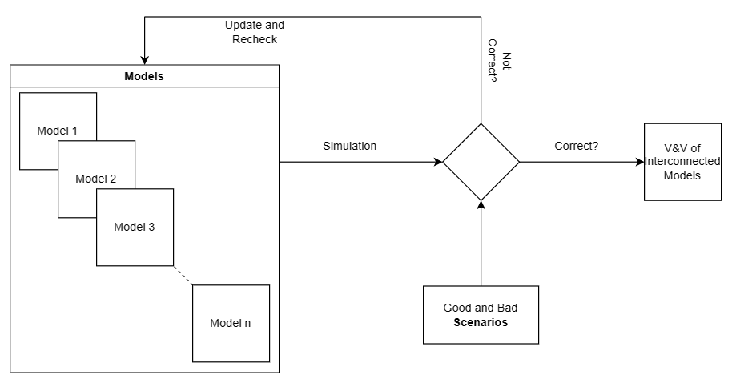
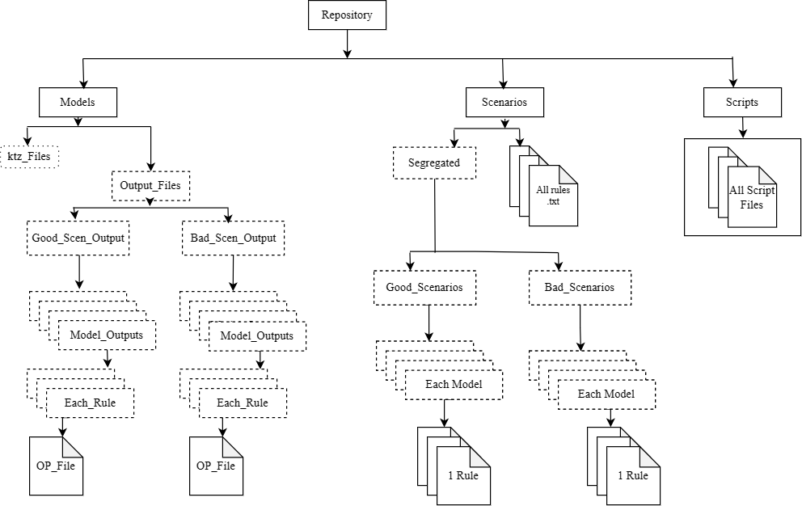

= M1+M2 Research project

:cocovad: https://github.com/CoCoVaD/website[CoCoVaD]
:tina: https://projects.laas.fr/tina/software.php[Tina Toolbox]
:eventB: http://www.event-b.org/install.html[Event-B]
:eclipse: https://www.eclipse.org[Eclipse]
:rodin: http://www.event-b.org/[Rodin]
:Sanjay: mailto:sanjay.ananda@student.isae-supaero.fr[Sanjay ANANDA]
:Goutham: mailto:ram-sai-goutham.emani@student.isae-supaero.fr[Ram Sai Goutham EMANI]

MBSE has become one of the successful Systems Engineering (SEN) practices and has replaced traditional SEN practice due to its added advantages. However, its application to larger systems is challenging owing to the increased complexity, diverse and poorly related data related to systems. A collaborative and continuous framework is a promising solution which is the objective of the Airbus’s CoCoVaD chair.

Chair has identified four key challenges: Vertical Integration, Horizontal Integration, Lifecycle Integration and Continuous Integration. This project is focused on Continuous Integration, referring to the automation of testing and validation of model throughout the system development cycle by developing guidelines for simulation of models.

Leaders::
- {sanjay}
- {goutham}

== Methodology

. Consider the model 
. Define “Good” and “Unauthorized” scenarios (Validation rules) 
. Simulate and validate the model automatically based on rules 
. If there exist some unauthorized scenarios, recheck the model and make the necessary modifications 
. Follow step 3 and 4 until there are no unauthorized scenarios anymore 
. When all the unauthorized scenarios are corrected, integrate the model into the global model and then follow the step 1 
. Iterate these steps until the desired outcome of the global model is achieved 

== Organization of Folders

The above image shows the folder organisation of the repository. When the debug option in the script is set to be "false" the "dotted folders" will be deleted. 
Please note that the "ktz_Files" folder is specific to the PetriNet models and would not be available for models of other formats.

== Tools Used
=== {rodin}
{eventB} is a formal method for system-level modelling and analysis, where set theory is used as a modelling notation.
The use of refinement to represent systems at different abstraction levels and the use of mathematical proof to verify consistency between refinement levels is an advantage of using this platform.

The Rodin-Platform is an {eclipse}-based IDE for Event-B that provides effective support for refinement and mathematical proof. The platform is open source, contributes to the Eclipse framework and is further extendable with plugins.

The information related to the {eventB} models can be found link:eventB/README.adoc/[here].

The Final_Output file which is generated after the automation of the validation process using the ProB model checker for the Event-B language can be found link:https://nightly.link/CoCoVaD/PublicProjects/workflows/artefact/master/eventB-report.zip/[here].

=== {tina}
TINA (TIme petri Net Analyzer) is a toolbox for the editing and analysis of Petri Nets.

A Petri net, also known as a place/transition (PT) net, is one of several mathematical modeling languages for the description of distributed systems. It is a class of discrete event dynamic system.

The information related to the PetriNet models can be found link:petriNet/README.adoc/[here]

The Final_Output file which is generated after the automation of the validation process using the SELT model checker for the PetriNet Models can be found link:https://nightly.link/CoCoVaD/PublicProjects/workflows/artefact/master/tina-report.zip/[here].